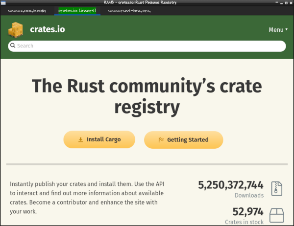

# RWB
Web browser written in Rust using a webkit2gtk interface. Minimal keyboard
driven interface inspired by vim and other browsers such as vimb, dwb and
qutebrowser.

This is an early WIP. It is usable for browsing the web but lacks the ability
to handle downloads, keep cookies, use any custom settings, etc. While features
may will be added, an express goal is to keep the program small, fast, and
usable on embedded platforms and SBC's running wimpy Arm and Risc-V processors.
To that end, the feature set is unlikely to ever match that of qutebrowser.



### Building
#### Requirements
You will need a recent Rust toolchain including Cargo. You will also need the
gtk+ and webkit2gtk libraries installed. Building is via cargo:
```cargo build --release```
After building, just copy the executable to somewhere in your path. If any of
this does not make sense to you, then you are probably not going to enjoy this
browser anyway...

## Keyboard shortcuts
### Global
* Ctrl-T - new tab with default url
* Ctrl-N - new blank tab
* Ctrl-W - close tab
* Ctrl-Q - close browser
* Esc - go to Normal mode
### Normal mode
* O - go to Command mode and open url
* Shift-O - go to Command mode and open url in new tab
* Shift-; (or ":") - go to Command mode
* I - switch to Insert mode
* U - go back
* Ctrl-R - go forward
* Shift-L - next tab
* Shift-H - previous tab
* D - close tab
* H - scroll left
* J - scroll down
* K - scroll up
* Ctrl-J - scroll to bottom
* Ctrl-K - scroll to top
* Ctrl-F - scroll one page down
* Ctrl-B - scroll one page up
* Ctrl-D - scroll half page down
* Ctrl-U - scroll half page up
* Y - copy current url to clipboard

## What's working
Basic browsing functionality, opening and closing tabs and pages, following
hyperlinks, etc. Navigation within pages works with common vim-like shortcuts.
Copying the current url to the clipboard.

## What's missing
There is no file downloading, bookmarking, search functionality, and no ability
to follow links in a new tab. When a page requests a new window it is currently
ignored. No session saving, user settings or preferences and no customization
other than the ability to change the source code.

Hinting of hyperlinks is not implemented at this time but is a planned feature.
